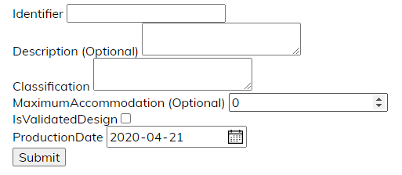
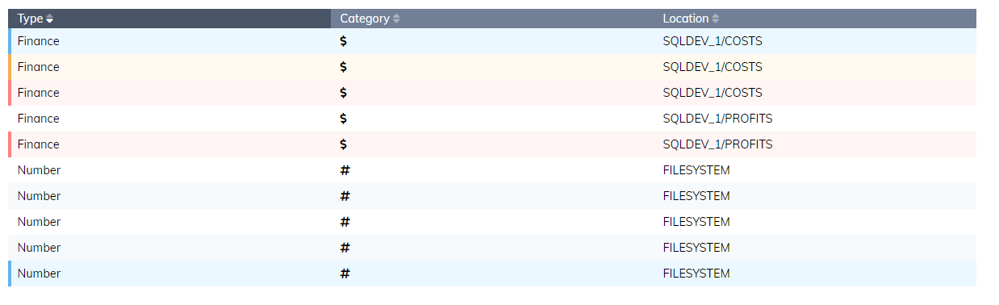

<!--
 Copyright (c) 2020 Apption Corporation
 
 This Source Code Form is subject to the terms of the Mozilla Public
 License, v. 2.0. If a copy of the MPL was not distributed with this
 file, You can obtain one at http://mozilla.org/MPL/2.0/.
-->

# Elemental Framework for Blazor

Elemental is a series of high level components designed to speed up Blazor projects.

Visit our [demo site](https://elemental-docs-app.azurewebsites.net/) for a live demo of all components and code details.

## Styled Buttons

Elemental styled buttons come with a built-in property for dark/light theme.


## Dropdown

Elemental dropdown binds to a property a list of objects in a single component.


## Model Form

The Model Form is attempt to streamline forms using annotations. Standard C# annotations such as Required, StringLength and Range will be passed to the form for validation and one single component will bind each public property of the model to Blazor form components.

```html
<ModelForm Model="@_starship" OnValidSubmit="HandleValidSubmit"/>
```

will render into:



## Search Bar

Standard component for search with a `OnInputChange` to directly send updates to the blazor backend.


## Table 

In the Elemental Table component, to separate the data from the layout, the source data is a list of objects and header and lines are obtained using a series of functions.

